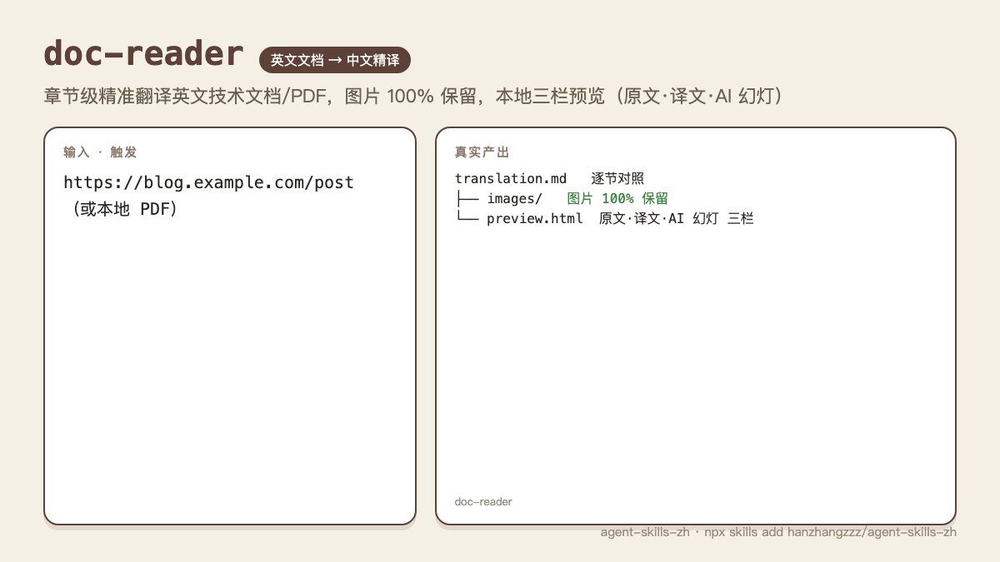
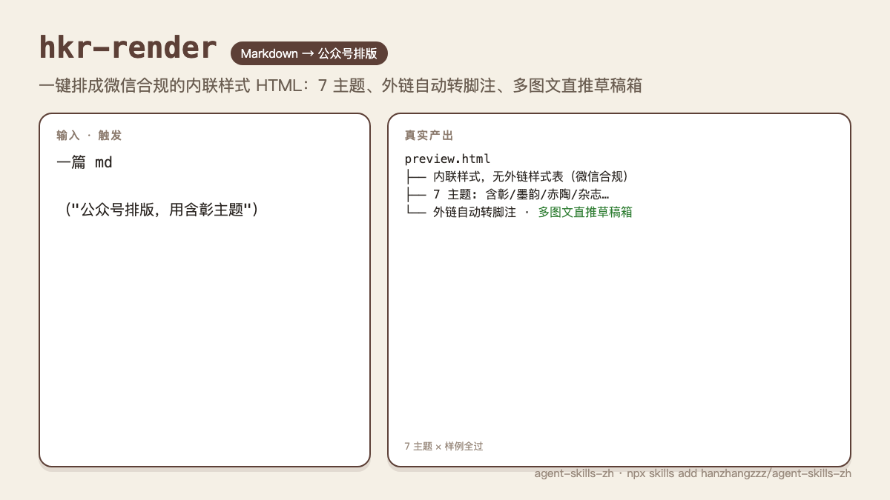
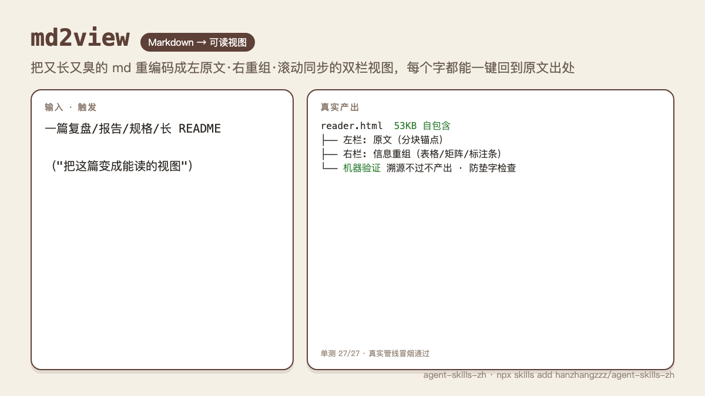
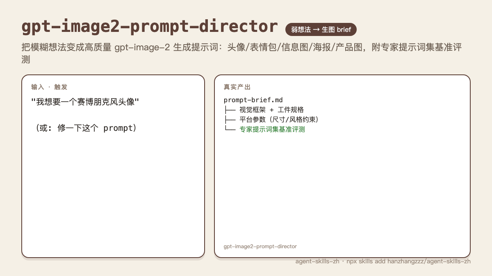
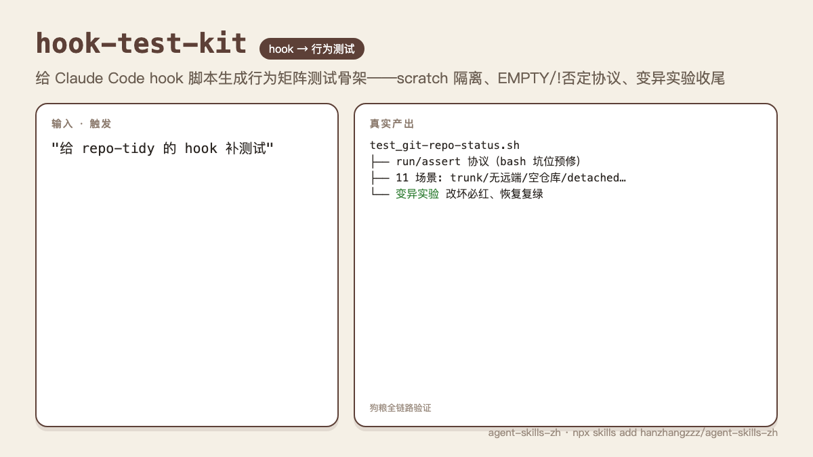
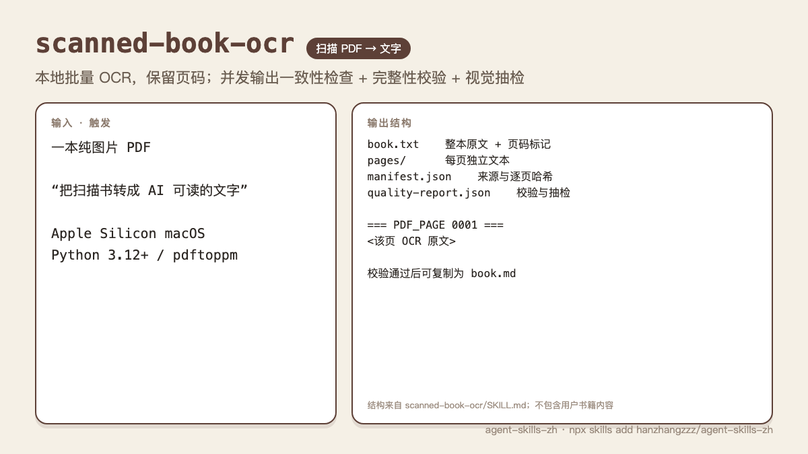

# agent-skills-zh

**中文** | [English](./README.en.md)

**Agent Skills for Claude Code, Codex and 20+ coding agents — built for Chinese-speaking developers.**
Translate English docs into Chinese, archive WeChat / Xiaohongshu / X content as Markdown, keep multi-repo Git hygiene, direct GPT-image prompts, and run autonomous improvement loops — one `SKILL.md` per capability, install only what you need.

**面向中文开发者的 Agent Skills 集合。** 英文技术文档精准翻译、公众号/小红书/X 内容存档、多仓库 Git 归位、GPT 生图提示词导演、AI 自治改进循环——每个能力一个 `SKILL.md`，按需安装，Claude Code 与 Codex 通用。

[](https://github.com/hanzhangzzz/agent-skills-zh/stargazers)
[](./LICENSE)
[](#skills)
[](#install)
[](#install)
[](https://skills.sh/hanzhangzzz/agent-skills-zh)


## Quick start · 快速开始

```bash
# Works with Claude Code, Codex, Cursor, Copilot, Windsurf, Gemini CLI and more
npx skills add hanzhangzzz/agent-skills-zh            # pick skills interactively
npx skills add hanzhangzzz/agent-skills-zh -s doc-reader -g   # install one skill globally
```

Then just talk to your agent — every skill lists its own trigger phrases (English and Chinese) in its `SKILL.md`, e.g. `/doc-reader <url>`, `排版`, `归位`, `做点什么`.

<a id="skills"></a>
## Skills · 技能一览

| Skill | What it does · 做什么 | Use when · 何时用 | Trigger · 触发 |
| --- | --- | --- | --- |
| [doc-reader](./doc-reader/) | Translate an English article/PDF into Chinese section by section, keep 100% of images, build a 3-column preview (original · translation · AI slides). 英文技术文档/PDF 章节级精准翻译，图片全保留，三栏本地预览 | Reading long English blogs, papers, docs and wanting a faithful side-by-side Chinese version | `/doc-reader <URL or PDF>` · `翻译这篇文章` |
| [scanned-book-ocr](./scanned-book-ocr/) | Local scanned PDF OCR → page-traceable text with deterministic concurrency checks and visual QA. 扫描书转文字，保留页码并校验质量 | Image-only books for AI reading; Apple Silicon macOS, Python 3.12+ | `$scanned-book-ocr` · `扫描 PDF 转文字` |
| [wechat-article-md-local](./wechat-article-md-local/) | Save a WeChat Official Account article as local Markdown with images. 公众号文章下载为本地 Markdown，图片本地化 | You receive an `mp.weixin.qq.com` link and want to archive, quote or analyze it | auto on `mp.weixin.qq.com` links · `下载公众号文章` |
| [xiaohongshu-downloader](./xiaohongshu-downloader/) | Download a Xiaohongshu (RedNote) video and transcribe the voice-over with Whisper into Markdown. 小红书视频下载 + 口播逐字稿 | You receive a Xiaohongshu video link and need the spoken content as text | auto on `xiaohongshu.com` / `xhslink.com` links · `小红书视频转文字` |
| [x-article-download](./x-article-download/) | Download a tweet, a long-form X article or a whole account to Markdown. X/Twitter 单条或整账号批量下载 | You receive an `x.com` link and want to archive or analyze it | auto on `x.com` links · `下载推文` |
| [hkr-render](./hkr-render/) | WeChat publishing pipeline: Markdown → styled HTML (7 themes) → cover image → draft box, multi-article supported. 公众号排版 → 封面 → 推送草稿箱 | Publishing WeChat articles; dark mode and mobile font sizes tuned | `排版` · `微信排版` · `/format` |
| [md2view](./md2view/) | Re-encode Markdown into a traceable two-column reading view (diagrams, flows, matrices) with every element anchored to the source. Markdown 重编码为可溯源的双栏阅读视图 | Retrospectives, reports, specs and long docs that people need to absorb and share | `/md2view` · `信息重组` |
| [gpt-image2-prompt-director](./gpt-image2-prompt-director/) | Turn a weak idea into a production-grade GPT image2 brief, with a built-in benchmark. GPT image2 提示词导演 + 评测门禁 | Avatars, sticker packs, infographics, covers, posters, product shots, or repairing a drifting prompt | `$gpt-image2-prompt-director` · `生图提示词` |
| [repo-tidy](./repo-tidy/) | Git tidy-up + parallel-task base: back to latest master, prune merged branches/worktrees, `--new` opens a task branch (parallel worktree when busy); SessionStart hook injects repo status. 仓库归位与并行任务底座 | Multi-repo + multi-task AI work where task branches pile up | `归位` · `开新任务` · `repo tidy` |
| [repo-map](./repo-map/) | Local repository map: self-healing index of all local git repos; a hook injects path + read/write role whenever a repo name is mentioned. 本地仓库地图，提到仓库名自动注入路径 | Cross-repo references where the AI keeps asking for paths | `仓库地图` · `repo-map` |
| [harness](./harness/) | Minimal Harness Engineering: Inspector → Worker → Reviewer loop driven by a shared `TODO.md`. 三角色 AI 自治改进循环 | You want an agent to continuously inspect, fix and review a repo, on demand or on a schedule | `/harness` · `启动 harness` |
| [do-something](./do-something/) | Answer feedback, choose work backed by real value evidence, finish and verify a durable outcome, or return NO-OP. `do/*` auto-merge requires separate value and execution verdicts. 自主推进项目：有价值且真正完成才交付，无事可做就停 | An idle project where the agent may work unattended without manufacturing tasks to keep the loop busy | `/do-something` · `做点什么` · `自己看着办` |
| [ci-review](./ci-review/) | Every PR/MR gets an execution verdict; configured bot branches also need a separate value verdict before deterministic auto-merge. Skill Markdown is reviewed as behavior code and failed verdicts are red checks. CI 里的验证型代码审查机器人，机器人分支价值与执行双门禁 | You want machine-verified execution, plus a value gate before unattended bot branches enter main | `/ci-review` · `装一个 CI 代码审查` |
| [git-push-guard](./git-push-guard/) | Hook-only plugin: intercepts direct pushes to `master`/`main`, asks for confirmation, per-repo allowlist. 纯 hook：直推默认分支拦截 | You let an agent commit and want shared-branch discipline enforced | auto on `git push` to master/main (plugin install only) |
| [hook-test-kit](./hook-test-kit/) | Scaffold behavior-matrix tests for Claude Code hooks: scratch fixtures, stdin JSON, EMPTY/! assertion protocol, mutation-experiment finish. 给 hook 脚本补行为测试 | 写了/改了 hook 脚本要测试 · `/hook-test-kit` |

## 效果一览 · Gallery

每张图都是真实产出或 skill 自带的真实文案/看板，不是示意图。

<!-- cards-gallery-start -->
<table>
<tr>
<td><a href="./doc-reader/"></a><br><b>doc-reader</b> · 英文文章 → 三栏中文预览 + AI 幻灯片</td>
<td><a href="./wechat-article-md-local/"></a><br><b>wechat-article-md-local</b> · 公众号文章 → 本地 Markdown</td>
</tr>
<tr>
<td><a href="./xiaohongshu-downloader/"></a><br><b>xiaohongshu-downloader</b> · 小红书视频 → 口播逐字稿</td>
<td><a href="./x-article-download/"></a><br><b>x-article-download</b> · 推文 / X 长文 / 整账号 → Markdown</td>
</tr>
<tr>
<td><a href="./hkr-render/"></a><br><b>hkr-render</b> · Markdown → 公众号排版（7 主题）→ 草稿箱</td>
<td><a href="./md2view/"></a><br><b>md2view</b> · Markdown → 可溯源的双栏阅读视图</td>
</tr>
<tr>
<td><a href="./gpt-image2-prompt-director/"></a><br><b>gpt-image2-prompt-director</b> · 一句话点子 → 可出图的完整 brief（真实出图）</td>
<td><a href="./repo-tidy/"></a><br><b>repo-tidy</b> · 归位 + 一条命令开任务分支</td>
</tr>
<tr>
<td><a href="./repo-map/"></a><br><b>repo-map</b> · 提到仓库名，自动注入路径与角色</td>
<td><a href="./git-push-guard/"></a><br><b>git-push-guard</b> · 直推 master/main 时拦下来问一句</td>
</tr>
<tr>
<td><a href="./harness/"></a><br><b>harness</b> · Inspector → Worker → Reviewer 看板循环</td>
<td><a href="./do-something/"></a><br><b>do-something</b> · 无人值守自主推进，合并即收割</td>
</tr>
<tr>
<td><a href="./ci-review/"></a><br><b>ci-review</b> · CI 里的验证型 CR，只验执行不评方向</td>
<td><a href="./hook-test-kit/"></a><br><b>hook-test-kit</b> · 给 hook 脚本生成行为矩阵测试，变异实验收尾</td>
</tr>
<tr>
<td><a href="./scanned-book-ocr/"></a><br><b>scanned-book-ocr</b> · 扫描 PDF → 页码可追溯的本地文本</td>
<td>飞轮实景：do-something 提出方向并实践 → ci-review 验证质量 → 下一轮先回应评论 → 人类只在想收割时出现。<br><br>本仓 PR #8 实录：机器人在审查规范的安装副本里发现一处逻辑矛盾（带失败场景与复现命令），开发者修复 push 后，增量审查确认"矛盾已由此 commit 消除"，零重复评论。</td>
</tr>
</table>
<!-- cards-gallery-end -->

<a id="install"></a>
## Install · 安装

### 1. `npx skills` (any agent · 推荐)

```bash
npx skills add hanzhangzzz/agent-skills-zh --list      # see what's inside
npx skills add hanzhangzzz/agent-skills-zh              # choose interactively
npx skills add hanzhangzzz/agent-skills-zh -s doc-reader -s md2view -g   # specific skills, user-level
npx skills update                                      # keep them fresh
```

`npx skills` detects Claude Code, Codex, Cursor, Copilot, Windsurf, Gemini CLI, Cline and others, and installs to the right directories.

### 2. Claude Code plugin marketplace (hooks auto-enabled · hook 自动生效)

```text
/plugin marketplace add hanzhangzzz/agent-skills-zh

/plugin install repo-tidy@agent-skills-zh        # + SessionStart repo-status hook
/plugin install repo-map@agent-skills-zh         # + UserPromptSubmit repo-map hook
/plugin install git-push-guard@agent-skills-zh   # hook-only: guard master/main
/plugin install doc-reader@agent-skills-zh
/plugin install md2view@agent-skills-zh
/plugin install hkr-render@agent-skills-zh       # needs config.json (WeChat AppID/Secret), see its SKILL.md
/plugin install do-something@agent-skills-zh
/plugin install harness@agent-skills-zh
/plugin install gpt-image2-prompt-director@agent-skills-zh
/plugin install wechat-article-md-local@agent-skills-zh
/plugin install x-article-download@agent-skills-zh
/plugin install xiaohongshu-downloader@agent-skills-zh
```

One plugin = one skill, so you can install, update (`/plugin update <name>@agent-skills-zh`) and uninstall each independently. Plugins with hooks (repo-tidy, repo-map, git-push-guard) work immediately — no `settings.json` edits.

### 3. Copy manually · 手动复制

```bash
git clone https://github.com/hanzhangzzz/agent-skills-zh.git
cd agent-skills-zh
cp -r doc-reader ~/.claude/skills/     # Claude Code
cp -r doc-reader ~/.codex/skills/      # Codex
# same for any other skill directory
```

Notes · 说明:
- `repo-map` auto-injection and `repo-tidy` session status rely on Claude Code hooks; on Codex the commands still work, the automatic injection does not.
- `hkr-render` needs a `config.json` with your WeChat AppID/Secret before first use (see its `SKILL.md`).
- `doc-reader` slide generation uses the local Codex CLI's built-in imagegen: `codex` must be on `PATH` and logged in. Use `--no-ppt` to skip slides.

### 4. Let your agent install it · 让 Agent 帮你装

Paste this to your agent:

```text
Install the skill "doc-reader" from https://github.com/hanzhangzzz/agent-skills-zh
(English technical article/PDF → accurate Chinese, images kept, 3-column preview HTML)
```

```text
安装 skill：hkr-render
描述：公众号完整管线：Markdown 排版（7 个主题）→ 封面 → 推送草稿箱（支持多图文）
安装源：https://github.com/hanzhangzzz/agent-skills-zh
```

## Why these skills · 为什么是这些

- **Content that lives on Chinese platforms** (WeChat, Xiaohongshu, plus X) is hard for agents to reach; the three downloaders turn links into local Markdown the agent can actually read, quote and translate.
- **Reading English docs in Chinese** should not lose images, structure or terminology — `doc-reader` keeps all three and adds AI slides on top.
- **Multi-repo, multi-task agent work** rots Git state fast; `repo-tidy` and `repo-map` keep every task on a clean branch with the right paths.
- **Agents that improve things while you are away** — `harness` and `do-something` are two levels of autonomy, from a reviewed three-role loop to "just pick the best thing and ship it".

## doc-reader

一条命令，把一篇英文技术文章变成可对照阅读的中文版：左栏原文、中栏译文（章节级翻译，术语一致，图片 100% 保留）、右栏每个章节一张 AI 知识卡幻灯片。下面是真实产出，输入是 Anthropic 的一篇客户案例：


幻灯片由本机 Codex CLI 内置 imagegen 生成，不需要图片 API Key。提示词经过单变量实验校准：画面可见汉字控制在 250 字以内，字形错误从平均 2.5 处/图降到 0（实验记录见 [doc-reader/instructions.md](./doc-reader/instructions.md)）。


```text
/doc-reader https://claude.com/blog/how-warp-builds-self-improving-agents-on-claude
/doc-reader ./paper.pdf --no-ppt      # 只翻译，不生成幻灯片
```

## hkr-render

Markdown 一键变成公众号可直接发布的排版，7 个主题，深色模式与手机端字号已调优；可选生成封面并推送到草稿箱，支持多篇合一条图文：


```text
排版这篇文章 ./article.md    # 打开主题画廊，用你的真实文章预览 7 个主题，选中即复制微信兼容 HTML
生成封面                     # 可选：封面亮度检查，浅色底自动加渐变暗化
推送到公众号草稿箱           # 可选：需要 config.json 里的 AppID/Secret
```

## GPT Image2 Prompt Director


`gpt-image2-prompt-director` 不是普通"风格词生成器"。它更像一个会先做判断的图像创意总监：先识别你真正要交付的视觉资产，再把弱输入改写成能直接喂给 GPT image2 的完整 brief，并用内置 benchmark 检查 prompt 是否只是看起来完整、实际却导向错误。

### 真实出图示例

下面这些图片来自同一批 GPT 真实生成结果，源文件均为 `regenerated-*` 开头；为了 README 加载速度，这里嵌入的是 900px 版本。

| 字体海报 | 文物信息图 |
| --- | --- |
|  |  |

| 小红书卡片 | 日记漫画 |
| --- | --- |
|  |  |

### 它解决什么问题

很多生图失败不是模型不行，而是 prompt 从一开始就把任务定义错了：

- 想要平台头像，却写成了电影感肖像。
- 想要小红书卡片，却只堆了一串高级形容词。
- 想要知识图鉴，却没有事实核验、信息层级和阅读路径。
- 想要表情包，却没有一致角色、独立单格和情绪清晰度。
- 想修 prompt，却不知道它到底缺角色、内容策划、视觉系统还是反失败约束。

这个 skill 会把"帮我做张高级图"拆成更可靠的结构：角色定位、反定义、输入契约、内部策划、内容策划、视觉系统、反失败约束、输出规格和自检。

### 能力文案板

**适合人群**

- 内容创作者：公众号、小红书、X、视频封面和知识卡片。
- 个人品牌作者：长期头像、IP 形象、表达系统。
- 设计协作者：需要把模糊需求翻译成可执行视觉 brief。
- Agent/Skill 作者：想用 benchmark 给生图 prompt 做回归评测。

**核心能力**

- 弱点子增强：从一句主题、标题、对象或场景，扩展成完整生图 brief。
- 无点子模式：用户只有身份、平台或目标时，先生成 10-20 个候选玩法，再选最强方向展开。
- 头像/IP 专项：默认优先 `3 x 3` 头像探索，强调圆形裁切、`80px` 可读性、脸部优先和符号层级。
- 表情包专项：默认 `4 x 4` 表情包系统，强调角色一致性、情绪清晰度和单格可用性。
- artifact-first：先确定图像容器，比如信息图、图鉴、海报、卡片、产品图、头像资产，而不是先堆风格词。
- 评测门禁：内置 40 个 benchmark cases、结构评分、能力覆盖评分和 hard gates。

**一句话触发**

```text
$gpt-image2-prompt-director 帮我把"AI 时代的个人知识库"做成一张适合公众号头图的高级图片 prompt。
```

**修复触发**

```text
$gpt-image2-prompt-director 下面这个头像 prompt 太像真人写真了，帮我修成可长期使用的平台头像资产，并解释问题在哪里。
```

### 效果试跑

仓库内置的 evaluator 可以验证 prompt 是否覆盖了必要结构和专项 hard gates。

```bash
cd gpt-image2-prompt-director
node scripts/eval_prompt_director.mjs \
  --case-id 40 \
  --prompt-file examples/readme-avatar-demo.md \
  --report /tmp/gpt-image2-prompt-director-readme-demo.md \
  --fail-under 80 \
  --strict
```

本 README 的头像案例已跑通：

| Case | 输入 | 结果 |
| --- | --- | --- |
| 40 | "公众号个人头像，有个性，有辨识度，略男性化，AI 先锋，独立作者，酷酷的；我不想要写实真人头像。" | 总分 `100`，structure `100`，capability `100`，hard gates 通过 |

你也可以跑完整基准集，观察当前 prompt 框架和 archived expert prompts 的差距：

```bash
cd gpt-image2-prompt-director
node scripts/eval_prompt_director.mjs --gold --report /tmp/gpt-image2-prompt-director-gold-report.md
```

> 说明：顶部流程图是示意图；"真实出图示例"来自本地同批 `regenerated-*` GPT 输出。实际生成质量仍取决于最终模型、输入素材和提示词执行环境。

## Harness

`harness` 是一个轻量的 Agent 自治循环：Inspector 负责巡检和拆任务，Worker 负责领取并修改，Reviewer 负责复审和验证。三者通过项目里的 `TODO.md` 共享状态，避免 Agent 在复杂仓库里"想到哪改到哪"。

### 能力文案板

**适合人群**

- 想让 Agent 定期巡检代码质量和未完成工作的项目维护者。
- 想把"发现问题 - 修复问题 - 复审验证"变成固定流程的工程团队。
- 想让多个 Agent 通过 `TODO.md` 看板协作，而不是靠聊天上下文接力。

**核心能力**

- Inspector：读取项目文档和当前状态，发现可执行任务，写入 `TODO.md`。
- Worker：领取 `[待领取]` 任务，修改代码，运行相关验证，再标记 `[待审查]`。
- Reviewer：检查 diff、验证结果和项目约束，通过后记录 Done Log，必要时提交。
- Loop 模式：持续消化任务，直到没有可安全推进的项。
- Cron 模式：在 Claude Code session 内定时触发 inspect/work/loop/full cycle。

**一句话触发**

```text
/harness 这轮重点关注静默数据丢失、环境变量错误和缺少验证的代码路径。
```

**常用命令**

```bash
cd <project> && bash ~/.codex/skills/harness/inspector.sh
cd <project> && bash ~/.codex/skills/harness/worker-reviewer.sh --loop
HARNESS_PROJECT_DIR=/abs/path/to/project bash ~/.codex/skills/harness/inspector.sh
```

## md2view


`md2view` 把一份 Markdown **重新编码**成人类读得进去的视图——不是渲染加样式,而是抽出信息结构换一种编码(架构图 / 流程链 / 对比矩阵 / 标注卡),且每个视图元素都能一键回到原文出处。它是 md2html 的继任者:旧的转格式,新的转视图。

**核心理念**:md 是给 AI 和 git 的权威源,HTML 是给人的消费投影;人类该读的不是文字墙,是按信息类型选最优编码的信息设计;有损压缩 + 可回溯 = 无损(每个元素溯源回原文,左原文右重组双栏锚定同步)。v4 起,表达归模型自由创作(组件词汇 + 设计系统),核证归机器(data-sources 锚点 + 词法锚点 + 数字逐字 + 100% 来源覆盖),生产者必须截图自审闭环。

它和市面 md→html 工具**正交**：那些是美化器（优化第一眼好看），`md2view` 是可信重编码器（优化敢拿去做决策、敢溯源微调）。

**一句话触发**

```text
/md2view 把这份复盘 md 变成双栏视图，左边原文右边重组
```

详见 [md2view/README.md](./md2view/README.md)。

## Contributing · 贡献

Each skill is a directory with a `SKILL.md` (YAML frontmatter: `name` = directory name, `description` = what + when to use, ≤1024 chars) plus optional `scripts/`, `references/`, `assets/`. No hard-coded paths. See [CLAUDE.md](./CLAUDE.md) for the full checklist, then open a PR — issues and skill requests are welcome.

If a skill saved you time, a ⭐ helps other people find it.

## Local development · 本地开发

```bash
# list available skills
find . -maxdepth 2 -name SKILL.md

# validate the Claude Code plugin manifest
claude plugin validate .

# run the GPT image2 prompt director sample evaluation
cd gpt-image2-prompt-director
node scripts/eval_prompt_director.mjs --case-id 40 --prompt-file examples/readme-avatar-demo.md --fail-under 80 --strict
```

## Layout · 目录

```text
.
├── .claude-plugin/marketplace.json   # Claude Code plugin marketplace (one plugin per skill)
├── MARKETPLACE.md                    # machine-readable registry for agents
├── doc-reader/                       # SKILL.md + instructions.md + scripts/
├── wechat-article-md-local/
├── xiaohongshu-downloader/
├── x-article-download/
├── hkr-render/
├── md2view/
├── gpt-image2-prompt-director/       # SKILL.md + examples/ + references/ + evals/ + scripts/
├── repo-tidy/
├── repo-map/
├── harness/                          # SKILL.md + prompts/ + inspector.sh + worker-reviewer.sh
├── do-something/
├── ci-review/
├── git-push-guard/                   # hook-only plugin
└── assets/readme/
```

## License

[MIT](./LICENSE)
