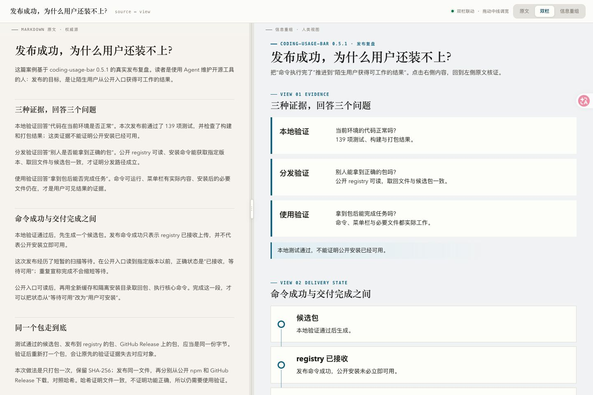

# md2view

> 把 Markdown 重新编码成人类真正读得进去的视图——不是渲染得好看,而是把**信息结构**抽出来换一种编码,且每个字都能一键回到原文出处。

`md2view` 是 md2html 的继任者:旧的转**格式**,新的转**视图**。


---

## 先试一个完整案例

**发布成功，为什么用户还装不上？** 把一篇开源工具发布复盘，重组为证据对照、交付状态、同包核验、实际使用、失败排查和用户反馈六个视图。它展示的是阅读与溯源能力，不是自动发布工具。



[原始 Markdown](examples/release-evidence/input.md) · [完整提示词](examples/release-evidence/prompt.txt) · [下载离线阅读器](https://raw.githubusercontent.com/hanzhangzzz/agent-skills-zh/main/md2view/examples/release-evidence/reader.html)

将阅读器保存为 `reader.html` 后用浏览器打开。点击右侧“用户可安装”会定位对应原文；点击左侧段落会定位右侧视图。顶部可切换原文、双栏和信息重组模式。HTML 无需服务器或账号；GitHub 文件预览不会执行交互。

只安装这一项技能：

```bash
npx skills add hanzhangzzz/agent-skills-zh --skill md2view
```

把案例原文和完整提示词交给已安装技能的 Agent，可重新生成自己的版本；模型的布局和措辞可能不同。若要复现仓库中这份成品，在仓库根目录运行：

```bash
python3 md2view/scripts/parse_blocks.py md2view/examples/release-evidence/input.md /tmp/md2view-case-blocks.json
python3 md2view/scripts/verify_anchors.py /tmp/md2view-case-blocks.json md2view/examples/release-evidence/right-pane.html
python3 md2view/scripts/build_reader.py /tmp/md2view-case-blocks.json md2view/examples/release-evidence/right-pane.html /tmp/md2view-case-reader.html --title '发布成功，为什么用户还装不上？'
```

此路径使用已公开的右栏设计，确定性地重建成品，不调用模型。该样例覆盖 22 个原文块、39 个溯源元素；已在 1440 和 768 像素视口检查布局，实际点验双向定位、抽屉展开和阅读模式。锚点检查通过不能替代语义复核。

## 为什么需要它

AI 生成的文档越来越多,也越来越又长又臭。而人在任务之间高速切换,注意力是最稀缺的资源——一份超过一屏的文档,很难一点点把细节抠准。

问题的根不在"不够好看",在**编码错位**:Markdown 是给 AI 和 git 读的线性文本,却被直接推给人一眼吸收。给一堵文字墙套上再漂亮的主题,它还是一堵墙。

`md2view` 的回答:**md 留给 AI,人读的是重新编码过的视图。**

## 核心洞察(设计理念)

**1. 源与视图分离。** Markdown 是给 AI 和 git 的**权威源**,HTML 是给人的**消费投影**。人读视图,AI 读 md,各得其所。

**2. 人类该读什么 = 信息重编码,不是加样式。** 按信息类型选最优编码:结构关系 → 图,对比 → 矩阵,流程 → 链,契约告警 → 标注条,不值得视觉化的 → 老实的散文。这件事有个古老的名字,叫**信息设计**。

**3. 压缩视图，保留可回溯的原文。** 每个视图元素通过 **source map** 回到来源，左原文、右重组，便于随时对照。来源锚点只能帮助核验出处，不能证明重组没有遗漏、误解或错误推断；交付前仍需语义复核。

**4. 表达归模型,核证归机器。** 把"什么值得表达、用什么形式"交给模板渲染器,得到的只会是"两个框一根箭头"的机械图——设计判断不可形式化。v4 让模型**自由设计并手写右栏 HTML**(组件词汇 + 设计系统),机器只负责可核证性:每个语义元素必须有 `data-sources` 锚点、可见文本必须保留词法锚点、数字必须逐字抄录、每个来源块必须被投影。**形式自由,锚点强制,自审闭环。**

**5. 看不见作品的设计师不可能及格。** 生产者必须在真实浏览器里截图、亲眼看、亲手改,至少两轮。机器检查可验证的锚点、文字与数字约束，自审检查表达和语义——不再用结构合法性冒充表达价值。

## 设计状态

当前生效版本是 **v4**(2026-08 重构),执行合同见 [SKILL.md](SKILL.md),设计依据见 [DESIGN.md](DESIGN.md);组件词汇见 [references/design-system.md](references/design-system.md),图画法见 [references/diagram-cookbook.md](references/diagram-cookbook.md),反面教材见 [references/anti-patterns.md](references/anti-patterns.md)。v3 及更早的自包含 reader 仍可离线打开;旧的 JSON 合同生成路径已删除(git 历史可回溯)。

## 流水线

```bash
python3 scripts/parse_blocks.py input.md blocks.json   # 1. 确定性来源账本
# 2. 模型通读全文,判断视图设计与形式(不选模板,先问读者要形成什么判断)
# 3. 模型自由创作 right-pane.html(mv-* 组件 + data-sources 锚点)
python3 scripts/verify_anchors.py blocks.json right-pane.html   # 4. 溯源门
python3 scripts/build_reader.py blocks.json right-pane.html reader.html  # 5. 构建(验证不过不产出)
# 6. 模型截图自审(1440 / 768),亲眼看、亲手改,≥2 轮
```

**适合**:信息结构厚的文档(复盘、报告、规格、长 README),要给人读或分享。
**不适合**:只要把 md 忠实转成带样式 html——那是普通渲染,别用它。

## 安装

```bash
git clone https://github.com/hanzhangzzz/agent-skills-zh.git
mkdir -p ~/.claude/skills/md2view
cp -R agent-skills-zh/md2view/. ~/.claude/skills/md2view/
test -f ~/.claude/skills/md2view/SKILL.md
# Codex 或其他安装方式见仓库根 README
```

`scripts/` 里的 Python 脚本零第三方依赖;截图环的 `shot.js` 需要 `@playwright/test` 或 `playwright` + Chromium(也可用 chrome-devtools / playwright MCP 代替)。

## 成本

一次转换 = 一次通读 + 一轮创作 + 机器验证 + 至少两轮截图自审。成本花在理解与设计判断上,而不是门禁文书上。

---

*md2view 继承 md2html 的哲学(md 为源、溯源、反 AI slop),v4 重新划分了职责:模型负责理解、设计与表达,确定性层负责左栏权威源、双栏联动与溯源验证。*
